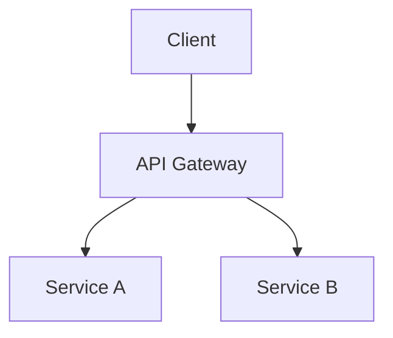

# /docs-gen [api|readme|architecture] [--format openapi|markdown|jsdoc]

## Usage Examples

```bash
/docs-gen api --format openapi       # Generate OpenAPI specification
/docs-gen readme                     # Generate/update README
/docs-gen architecture               # Generate architecture docs
```

## Documentation Types

### API Documentation
- OpenAPI/Swagger specification
- Endpoint descriptions
- Request/response examples
- Authentication requirements

### README Generation
- Project overview
- Installation instructions
- Usage examples
- Configuration guide

### Architecture Documentation
- System design diagrams
- Component relationships
- Data flow documentation
- Decision records

## Process

1. **Analysis**
   - Scan source code for documentation
   - Identify API endpoints and contracts
   - Extract JSDoc/docstrings

2. **Generation**
   - Create structured documentation
   - Generate diagrams (Mermaid)
   - Include code examples

3. **Validation**
   - Verify completeness
   - Check example accuracy
   - Ensure consistency

## Output Formats

### OpenAPI (api)
```yaml
openapi: 3.0.0
info:
  title: API Title
  version: 1.0.0
paths:
  /users:
    get:
      summary: Get all users
      responses:
        '200':
          description: Success
```

### Markdown (readme)
```markdown
# Project Name

## Installation
npm install project-name

## Usage
import { feature } from 'project-name';
```

### Architecture (mermaid)


## Best Practices

- Keep documentation close to code
- Include practical examples
- Update on every API change
- Use consistent formatting
